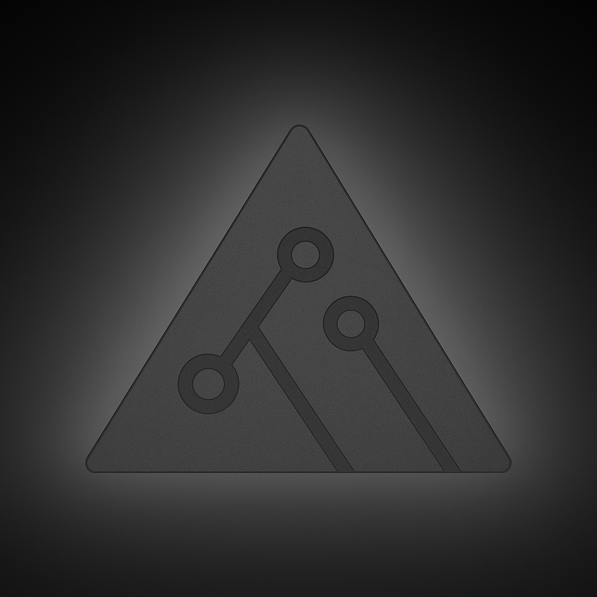
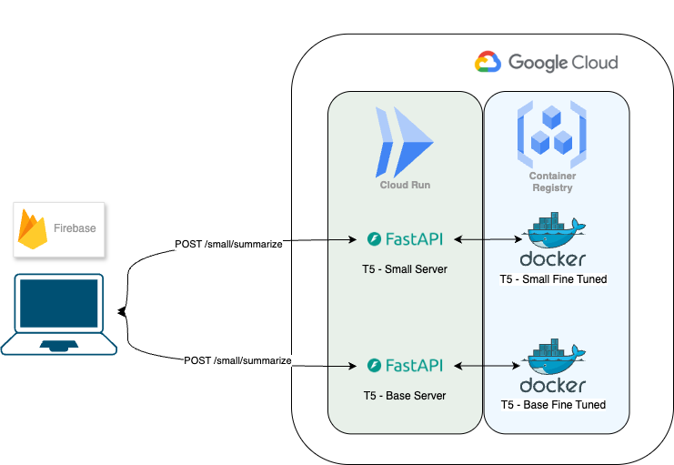

<p align="center">
  
</p>

<h1 align="center">Summit Mind</h1>
<p align="center">
  <em style="font-size: 18px; font-family: 'Arial'; font-weight: 300;">
    Summit Mind is a portfolio project built to experiment with and deploy lightweight abstracted summarization models based on the T5 (Text-to-Text Transfer Transformer series) models. Designed to summarize multi-turn conversations (e.g., meetings, support chats), Summit Mind combines ML tuning with real-world deployment workflows to run in scalable cloud environments like Docker, Google Artifact Registry, Google Cloud Run, and Firebase.
  </em>
</p>

---

## Project Outline

This project fine-tunes pretrained T5-small and T5-base models on the [SAMSum dataset](https://huggingface.co/datasets/samsum) to generate high-quality, human-like summaries of dialogues. It exposes a FastAPI REST API for integration into apps and services. A simple UI was built for demonstration. The project explored the capabilities of local training within a CPU bound training environment and limited RAM. This limited training to the Small and Base models as well and only a few epochs.

This project leverages **transfer learning**: we start with a T5 model that was pretrained on massive general-purpose text corpora, and **fine-tune** it on the SAMSum dataset — a corpus specifically composed of short human-like messenger conversations paired with manually written summaries.

In order to demonstrate the two models a multi server architecture was built to send summary request to the both models and evaluate the latency and responses. Now each server instance is independently deployed with just one model (either t5-small or t5-base). This improves startup speed, memory efficiency, and reduces container image size. The servers were built using FastAPI and containerized with Docker, then deployed to Google Cloud Run via Artifact Registry (Container Registry). Each service runs in a separate Cloud Run instance for isolated, scalable inference.

Important - This project was for learning and experience purposes and the models are not efficiently trained for production. In playing with the UI you will notice the responses are unacceptably slow and poor.

<p align="center">
  
</p>

---

## What is the SAMSum Dataset?

The **SAMSum dataset** is a collection of over 16,000 short conversations written in the style of instant messaging apps (like WhatsApp or Messenger). Each dialogue is annotated with a manually written summary that captures the key points in a few sentences.

Example:

```
Dialogue:
A: Hey, are we still on for lunch today?
B: Sorry, I got pulled into a meeting. Can we reschedule?

Summary:
A and B planned lunch, but B postponed due to a meeting.
```

This dataset is especially useful for training models that need to understand the flow and intent of real-time dialogue, such as meeting assistants, chat summarizers, and support ticket transformers.

---

## 🔧 Key Features

- ✍️ **Abstractive dialogue summarization** (e.g., meetings, chats)
- ⚙️ **Fine-tuned Hugging Face T5 models** using transfer learning principles
- 📦 **Deployable via Docker & Cloud Run** for serverless, scalable inference
- 🔁 **Support for model switching** with `MODEL_NAME=small` or `base`
- 🧪 **Custom training pipeline** using `Seq2SeqTrainer` with ROUGE scoring
- 💾 **Efficient memory-aware tokenization and padding**
- 📈 **Evaluation using ROUGE-L + early stopping** for practical tuning

---

## 🛠 Tech Stack

- Python 3.10
- FastAPI
- Hugging Face Transformers, Datasets, and Evaluate
- PyTorch (used as the backend framework for training and inference)
- Docker / Docker Buildx
- Google Cloud Platform: Artifact Registry & Cloud Run

---

## 📊 Training Configuration

Fine-tuned models using:

- Dataset: `samsum` (via Hugging Face Datasets)
- Base models: `t5-small` and `t5-base` (pretrained by Google)
- Tokenizer: padding to multiple of 8 for optimized batching on GPU
- Max input length: 512 tokens
- Max output length: 152 tokens
- Label smoothing: `0.1`
- Metric: `ROUGE-L` (measuring summary overlap quality)
- Training duration: 1 to 3 epochs depending on the model and local resources

---

## 🧪 Lessons Learned

Experimented with:

- Different batch sizes and padding strategies for better performance
- Label smoothing to improve generalization of generation
- Explicit device placement to match training and inference flows
- Comparing small vs base T5 for memory footprint and accuracy
- Using custom data collators and early stopping to improve training speed and output quality
- experimented with optimizing Server Setup for Low Latency (though time limited). We made several deliberate optimizations to reduce latency and improve cold-start performance, especially important in serverless environments like Cloud Run:
